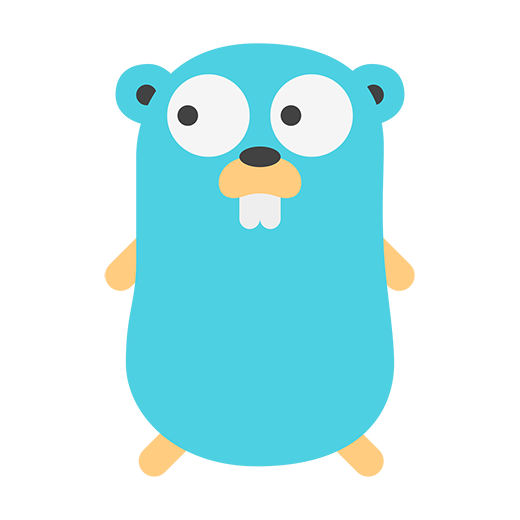

# Hi There ✍️

I am working on my postgraduate career.

You could visit my blog on [cufoon.com](https://cufoon.com)🌏 (under refactoring)

Or **my pins below** maybe give you some help if you need.

The following are what I like:

  
  
  
  
  
  
  
  
  
  
  

<!--  -->
